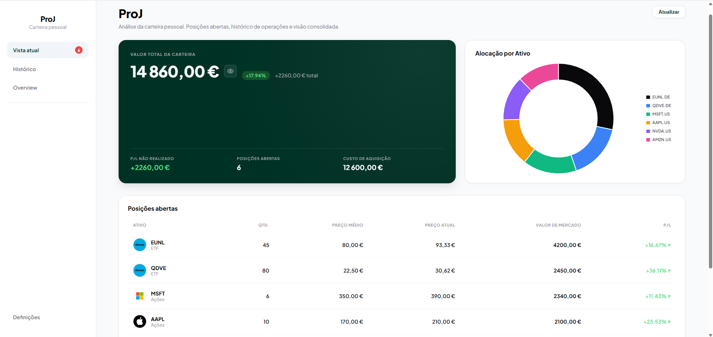
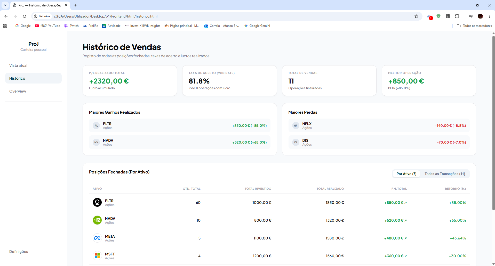
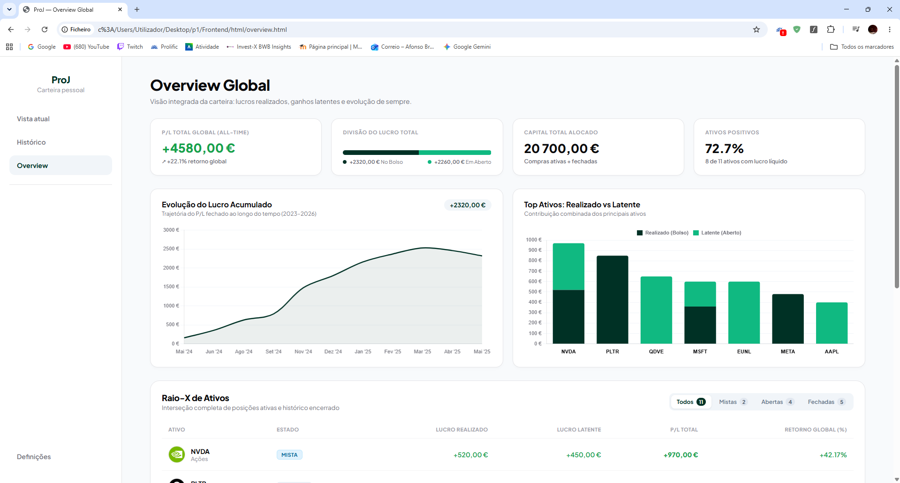
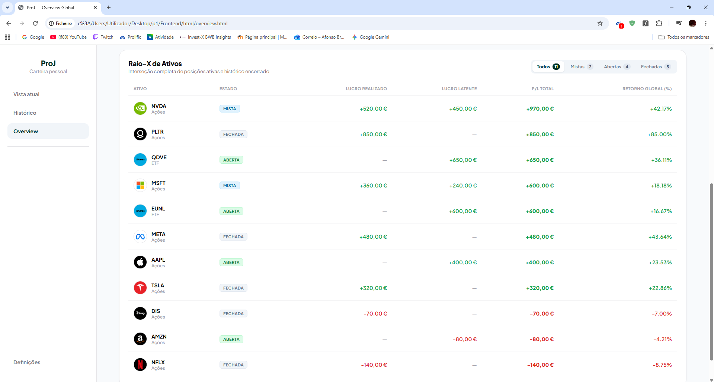

# ProJ — Plataforma Pessoal de Gestão e Análise de Investimentos

Uma aplicação web concebida para acompanhamento analítico, consolidação de histórico e avaliação de desempenho de uma carteira pessoal de ações e ETFs europeus.

---

## A Motivação: Porquê sair do Streamlit?

Durante muito tempo utilizei um dashboard desenvolvido em Streamlit. Embora seja uma ferramenta fantástica para protótipos rápidos de Data Science, com o crescimento da carteira e das operações comecei a deparar-me com limitações estruturais:
* **Recarregamento constante:** No Streamlit, qualquer interação do utilizador reexecuta o script de ponta a ponta, tornando a navegação pesada.
* **Rigidez visual:** Era difícil atingir um acabamento moderno, com controlo milimétrico de layout e micro-interações.

**A decisão:** Migrar para uma arquitetura clássica cliente-servidor, desacoplando totalmente o Backend (FastAPI) do **Frontend (HTML/CSS/JS)**. O resultado foi uma aplicação instantânea, fluida e com total liberdade criativa.

---

## Demonstração Visual

### 1. Vista Atual (Posições em Aberto & Alocação)

### 2. Histórico de Vendas (Registo de Operações & Taxa de Acerto)

### 3. Overview Global (Cruzamento All-Time: Realizado vs Latente)

---

## Raciocínio & Decisões de Engenharia

### 1. A Matriz "Raio-X": O Desafio das Posições Mistas
A maioria das corretoras e plataformas divide os investimentos de forma estanque: ou mostram o que temos em carteira *hoje*, ou mostram um relatório fiscal das vendas *passadas*. 

Se comprei e vendi frações de Nvidia ou Palantir várias vezes ao longo de anos com lucro, e ainda detenho ações hoje, qual foi a riqueza real que essa empresa gerou na minha vida?
Para responder a isto, desenvolvi uma lógica que cruza o passado com o presente e segmenta os ativos em 3 estados:
*  **Abertas:** Posições ativas sem qualquer venda histórica.
*  **Mistas:** Posições onde já realizei lucros/perdas no passado, mas continuo com capital alocado no mercado.
*  **Fechadas:** Ciclos de investimento completamente encerrados.

### 2. Pragmatismo Técnico: Porquê Vanilla JavaScript?
Num ecossistema onde a tendência é usar React, Next.js ou Vue para tudo, a escolha aqui foi deliberada: JavaScript e CSS.
* **Manutenção centralizada:** Criação do módulo `utils.js` para funções transversais (formatação de moeda `pt-PT`, tratamento de datas, ligações à API e logos da Parqet via ISIN), eliminando mais de 100 linhas de duplicação de código.

### 3. Pipeline ETL e Tratamento de Dados da Corretora
Os ficheiros brutos exportados da corretora trazem formatações complexas, cabeçalhos em linhas variáveis e operações misturadas. O pipeline em Python processa, limpa e persiste os dados numa base de dados relacional SQLite, garantindo tipos consistentes e atualizando as cotações em tempo real através da biblioteca `yfinance`.

---

## Importação de Dados e Convenção de Nomes dos Ficheiros Excel

O script de importação (`Backend/codigo/tabelas_ligacaobc.py`) lê os relatórios brutos da corretora depositados na pasta `DATA/`.

> [!IMPORTANT]
> O pipeline ETL depende estritamente dos nomes exatos dos ficheiros e dos respetivos offsets de cabeçalho para processar os dados corretamente:

| Nome do Ficheiro | Caminho | Descrição | Linha de Cabeçalho |
| :--- | :--- | :--- | :--- |
| **`open_raw.xlsx`** | `DATA/open_raw.xlsx` | Relatório com as posições atualmente abertas e preços médios de compra | Linha 11 (`header=10`) |
| **`closed_raw.xlsx`** | `DATA/closed_raw.xlsx` | Relatório com o histórico completo de transações de venda encerradas | Linha 5 (`header=4`) |
| **`livro2.xlsx`** | `DATA/livro2.xlsx` | Registo de movimentos de caixa contendo depósitos e levantamentos | Linha 5 (`header=4`) |

---

## Stack Tecnológica

* **Backend:** Python 3, FastAPI, SQLite3, Pandas, yfinance, openpyxl
* **Frontend:** HTML, CSS3 , Vanilla JavaScript
* **Visualização de Dados:** Chart.js (curva de lucro acumulado e barras empilhadas)

